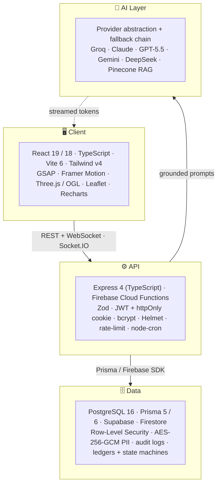
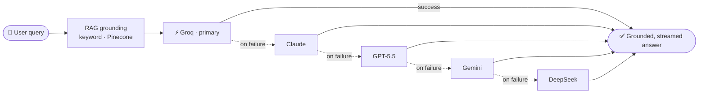

<div align="center">

# 👋 Hi, I'm Haris Ihsan Abadi

### Full-Stack Engineer · AI Product Builder

_I ship production web products that fuse **full-stack architecture**, **guardrailed AI**, and **editorial-grade UX** — across EdTech, FinTech, AgriTech/GIS, marketplaces, and knowledge systems._

<br>

[](mailto:haris.emailtugas@gmail.com)
[]()
[]()
[]()

</div>

---

## 🧠 Engineering Philosophy

> **Ship products, not boilerplate.** Every repository below is a real, production-shaped system. I optimize for **architecture that makes sense**, **AI with guardrails** (RAG grounding + multi-provider fallback, never raw hallucination), and **interfaces that don't feel auto-generated**.

```
domain modeling → AI augmentation → production hardening → editorial polish
```

---

## 🛠️ Tech Stack

**Languages**


**Frontend**


**Backend & Realtime**


**Data & Infrastructure**


**AI / LLM**


---

## 📦 Featured Work

### 🎓 ExamHub — Secure, AI-Assisted Online Exams
`EdTech · Online Assessment`
> Full-stack exam platform with AI question generation, real-time anti-cheat telemetry, and multi-role portals — delivered as one deploy-friendly monolith.
- **Stack:** React 19 · TypeScript · Express 4 · Prisma 5 · PostgreSQL 16 · Socket.IO 4 · Google Gemini
- **Highlights:** monolith (Express serves the Vite build, HMR middleware in dev) · AI MCQ generator + grammar/distractor polish · live monitoring with **9 configurable anti-cheat signals** · JWT + httpOnly auth · auto-grading + audit logs · DOCX/PDF ingestion · **9 Prisma models**

### 📚 PerpusAI — AI-Powered Digital Library
`AI Knowledge · RAG`
> A research assistant, digital reading room, and library-management system in one — RAG-grounded so the AI cites real holdings, not hallucinations.
- **Stack:** React 19 · Express 4 · Prisma 5 · PostgreSQL/Supabase · Pinecone · Midtrans · node-cron
- **Highlights:** **5-provider LLM fallback chain** (Groq → Claude/GPT/Gemini/DeepSeek) · keyword + Pinecone RAG · slash commands (`/rangkum`, `/sitasi`, `/kuis`…) · integrated chapter + PDF reader with highlights & "Ask AI" · citation engine (APA/IEEE/BibTeX/RIS/CSV) · report generator → DOCX/PDF · signature-verified Midtrans webhooks · cron-driven overdue/fine/reminder jobs · **18 Prisma models**

### 🎫 TemuJasa — Technical & Creative Services Marketplace
`Marketplace · Escrow · AI`
> Connects clients with IoT, software, data/AI, and creative experts — AI drafts the brief, escrow protects the funds, progress streams live.
- **Stack:** React 19 · Express 4 (TS) · Prisma 6 · PostgreSQL 16 · Socket.IO 4 · Groq + OpenRouter
- **Highlights:** ledger-backed **escrow state machine** (`UNPAID → PAID_ESCROW → RELEASED/REFUNDED`) · AI consultation → brief + milestones · real-time queue/progress/chat · RBAC (Client/Provider/Admin) · **AES-256-GCM PII encryption** + audit logs (UU PDP-aligned) · dispute arbitration · Helmet + rate-limit + Zod · gateway-ready (Midtrans/Xendit) · **14 Prisma models**

### 🌾 SawahScan AI — Web GIS for Rice-Field Health
`AgriTech · Web GIS`
> Turns complex multispectral drone analytics (RGB / YOLO / NDVI) into a clean dashboard, interactive map, and actionable field diagnostics.
- **Stack:** React 19 · Express 4 (TS) · Prisma 5 · PostgreSQL 16 · Leaflet + OpenStreetMap · Docker Compose
- **Highlights:** **3-service Docker Compose** (db/backend/frontend) with persistent volumes + auto-migrate · Leaflet sector mapping · per-scan multispectral galleries · Zustand + TanStack Query · Gemini insight layer · JWT + bcrypt · GSAP + Lenis smooth-scroll UI

### 💰 Saku — Smart Personal Finance
`FinTech · Personal Finance`
> Master your money from one minimalist dashboard — accounts, transactions, budgets, savings goals, and an AI advisor grounded in your real data.
- **Stack:** React 19 · TypeScript · Vite 6 · Tailwind v4 · TanStack Query · Supabase (Postgres + RLS) · Edge Functions
- **Highlights:** **atomic** internal transfers · budget & savings tracking · Recharts analytics · Saku AI advisor via OpenRouter gateway · Row-Level Security + AES-256 · **unit-tested** finance aggregation · dark mode, fully responsive

### 📲 UniPortal — Smart Campus Attendance
`Campus SaaS · Attendance`
> Replaces paper roll-call with time-limited QR check-ins, real-time tracking, and live analytics keeping students, lecturers, and admins in sync.
- **Stack:** React 18 · TypeScript · Vite 6 · Tailwind v4 · Firebase (Auth + Firestore + Cloud Functions) · Recharts
- **Highlights:** time-bound **QR sessions** (no student accounts needed) · Firestore real-time listeners · **4-role RBAC** (Admin/Lecturer/Student/Public) · bulk CSV/Excel import (Papa Parse, SheetJS) · calendar heatmap + KPI cards · PDF/Excel export (jsPDF, html2canvas) · ⌘K command palette · WebGL landing (OGL)

### 🎨 Dark Portfolio — Cinematic, CMS-Driven Landing
`Creative · WebGL`
> A portfolio that reads like a magazine and animates like a product launch — fully editable from a built-in back office with live preview.
- **Stack:** React 19 · TypeScript · Vite 6 · Tailwind v4 · Three.js (react-three-fiber) + OGL · GSAP · Framer Motion · Supabase Realtime
- **Highlights:** live **WebGL aurora** background · GSAP + Motion scroll choreography · glassmorphism + crossfaded ambient audio · built-in CMS at `/bts-porto` with live-preview iframe · Supabase Realtime instant re-render · HLS streaming · Vercel Analytics + Speed Insights

---

## 🏗️ How I Build

- 🔌 **Vendor-agnostic AI** — provider abstraction with a fallback chain (Groq → Claude → GPT → Gemini → DeepSeek), so no single outage or price change breaks the product.
- 🛡️ **Guardrail-first AI** — keyword/Pinecone RAG retrieval *before* hitting the LLM; answers stay grounded in real data.
- ⚡ **Real-time by default** — Socket.IO rooms (`exam:{id}`, `project:{id}`) and Firestore listeners for live monitoring, queues, and chat.
- 🔒 **Production hardening** — JWT httpOnly cookies, bcrypt, AES-256-GCM PII, Row-Level Security, Helmet, rate-limiting, Zod validation, audit logs, idempotent webhooks.
- 🧱 **Pragmatic deploys** — TypeScript monolith (Express + Vite middleware) for solo/small-team velocity; Docker Compose for reproducible/VPS; Vercel + Firebase serverless.
- 🎯 **Domain modeling** — ledgers and explicit state machines (escrow), strongly-typed schemas end-to-end with Prisma.

### Reference Architecture



### Multi-Provider AI Fallback (RAG-grounded)



---

## 📊 By the Numbers

<div align="center">

| Metric | Count |
| --- | --- |
| Production full-stack products | **7** across **7** domains |
| LLM providers integrated (with fallback) | **5** — Groq · Claude · GPT-4 · Gemini · DeepSeek |
| Primary data layers | PostgreSQL · Supabase · Firestore · Pinecone |
| Default language | **TypeScript**, end-to-end |

**Domains shipped:** EdTech · FinTech · AgriTech / GIS · Marketplace & Escrow · AI / RAG Knowledge · Campus SaaS · Creative / WebGL

</div>

---

## 📈 GitHub Stats

<div align="center">


</div>

---

<div align="center">

### 📬 Let's Build Something

Have a product idea that needs **grounded AI**, **solid full-stack architecture**, or **editorial UX**?

**[haris.emailtugas@gmail.com](mailto:haris.emailtugas@gmail.com)**

<sub><i>Every project above is a real implementation — not a demo or template.</i></sub>

</div>
